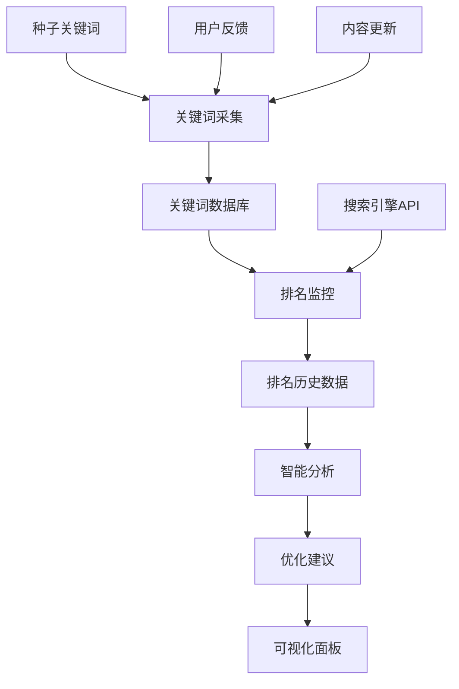

# 🎯 24小时关键词排名监控系统

## 📖 系统概述

这是一个完全自动化的关键词排名监控系统，集成了智能关键词采集、多引擎排名监控、数据分析和优化建议功能。系统通过GitHub Actions实现24小时不间断运行，为Telegram导航站提供强大的SEO支持。

## 🚀 核心功能

### 1. 智能关键词采集 (`keyword-collector.js`)
- **多源采集**: 百度、360、搜狗搜索建议 + 相关词扩展
- **智能过滤**: 基于相关性、质量和商业价值的多维度过滤
- **实时评分**: 根据搜索量、竞争度、相关性自动评分
- **增量更新**: 智能识别新关键词，避免重复采集

**特性**:
- 支持中英文关键词采集
- 每日最多采集5000个关键词
- 自动去重和质量控制
- 生成详细的采集报告

### 2. 多引擎排名监控 (`ranking-monitor.js`)
- **覆盖引擎**: 百度、Google、Bing、360搜索
- **批量监控**: 支持监控200+关键词
- **趋势分析**: 自动分析排名变化趋势
- **机会识别**: 智能识别优化机会

**特性**:
- 每4小时执行一次排名检查
- 支持多页搜索结果分析
- 自动处理搜索引擎反爬限制
- 实时排名变化通知

### 3. 智能分析系统 (`keyword-analyzer.js`)
- **综合评分**: 基于多维度指标的智能评分
- **机会识别**: 自动识别高价值优化机会
- **趋势预测**: 基于历史数据的趋势分析
- **优化建议**: 个性化的SEO优化建议

**分析维度**:
- 排名表现分析
- 竞争强度评估
- 内容相关性检查
- 用户意图匹配度

### 4. 可视化监控面板 (`keyword-ranking-dashboard.html`)
- **实时数据**: 实时展示关键词排名变化
- **图表分析**: 多维度数据可视化
- **交互控制**: 支持手动触发各种任务
- **移动适配**: 响应式设计，支持移动设备

**功能特色**:
- 排名趋势图表
- 搜索引擎分布分析
- 优化机会列表
- 系统状态监控

## ⚙️ 系统架构

```
24小时关键词排名监控系统
├── 数据采集层
│   ├── keyword-collector.js     # 关键词采集
│   └── ranking-monitor.js       # 排名监控
├── 数据存储层
│   ├── data/keywords/           # 关键词数据库
│   ├── data/rankings/           # 排名历史数据
│   └── data/analysis/           # 分析结果数据
├── 分析处理层
│   ├── keyword-analyzer.js      # 智能分析引擎
│   └── reports/                 # 分析报告
├── 展示交互层
│   ├── keyword-ranking-dashboard.html  # 可视化面板
│   └── 24h-system-dashboard.html       # 系统总控制台
└── 自动化层
    ├── .github/workflows/keyword-ranking-system.yml
    └── .github/workflows/24h-auto-system.yml
```

## 🕐 执行时间表

| 任务类型 | 执行频率 | 执行时间 (北京时间) | 说明 |
|---------|----------|-------------------|------|
| 关键词采集 | 每日2次 | 10:00, 22:00 | 采集新关键词，更新数据库 |
| 排名监控 | 每4小时 | 00:30, 04:30, 08:30, 12:30, 16:30, 20:30 | 检查所有关键词排名 |
| 智能分析 | 每日1次 | 09:00 | 生成分析报告和优化建议 |
| 系统健康检查 | 每30分钟 | 持续监控 | 检查系统状态和数据完整性 |
| 数据备份 | 每日1次 | 02:00 | 备份所有数据和配置 |

## 📊 数据流程



## 🛠️ 安装配置

### 1. 环境要求
- Node.js 16.0+
- GitHub Actions 支持
- 足够的存储空间用于数据和日志

### 2. 依赖安装
```bash
cd scripts
npm install
```

### 3. 配置文件
在GitHub仓库设置中配置以下Secrets（可选）:
- `GOOGLE_SERVICE_ACCOUNT_KEY`: Google Search Console API密钥
- `BAIDU_PUSH_TOKEN`: 百度搜索资源平台Token
- `BING_API_KEY`: Bing Webmaster Tools API密钥
- `YANDEX_API_KEY`: Yandex Webmaster API密钥

### 4. 启动系统
系统将自动通过GitHub Actions运行，也可手动执行：

```bash
# 关键词采集
npm run collect

# 排名监控
npm run monitor

# 智能分析
npm run analyze

# 完整流程
npm run full-system
```

## 📈 使用指南

### 1. 监控关键词排名
访问 `keyword-ranking-dashboard.html` 查看：
- 实时排名数据
- 趋势分析图表
- 优化机会列表
- 系统运行状态

### 2. 查看分析报告
系统会自动生成以下报告：
- `keyword-collection-*.json`: 关键词采集报告
- `ranking-monitor-*.json`: 排名监控报告
- `keyword-analysis-*.json`: 智能分析报告
- `optimization-suggestions.md`: 优化建议报告

### 3. 手动控制系统
在GitHub Actions页面可以：
- 手动触发关键词采集
- 强制执行排名监控
- 启动智能分析
- 查看执行日志

### 4. 数据导出
所有数据以JSON格式存储，支持：
- 关键词数据导出
- 排名历史导出
- 分析结果导出
- 报告数据导出

## 🎯 优化策略

### 1. 高价值关键词优化
- 识别得分8.0+的关键词
- 优先优化排名11-20位的关键词
- 为无排名的高价值词创建专门内容

### 2. 快速见效机会
- 关注排名11-15位的关键词
- 优化用户体验和页面质量
- 加强内链建设

### 3. 长期机会发掘
- 持续采集新兴关键词
- 监控竞争对手关键词策略
- 建立系统的内容规划

## 📋 监控指标

### 核心KPI
- **监控关键词数量**: 目标200+个
- **平均排名**: 目标<15位
- **前10排名数量**: 目标30+个
- **首页排名数量**: 目标50+个
- **优化机会数量**: 持续识别和处理

### 系统性能
- **采集成功率**: >95%
- **监控成功率**: >90%
- **数据完整性**: >99%
- **系统可用性**: >99.5%

## 🔧 故障排除

### 常见问题

**1. 关键词采集失败**
- 检查网络连接
- 验证API限制
- 查看错误日志

**2. 排名监控异常**
- 检查搜索引擎反爬限制
- 调整请求频率
- 验证User-Agent设置

**3. 数据分析错误**
- 检查数据文件完整性
- 验证JSON格式
- 查看分析日志

### 日志查看
- GitHub Actions执行日志
- `logs/` 目录下的详细日志
- 系统健康检查报告

## 🔄 更新升级

### 版本更新
系统支持无缝更新：
1. 拉取最新代码
2. 自动迁移数据格式
3. 重启相关服务
4. 验证系统功能

### 配置调整
可以通过修改配置文件调整：
- 关键词采集频率
- 排名监控范围
- 分析算法参数
- 报告生成周期

## 📞 技术支持

### 系统监控
- 24小时自动监控系统状态
- 异常情况自动报警
- 定期生成健康报告

### 问题反馈
- GitHub Issues: 提交bug和功能请求
- 系统日志: 查看详细错误信息
- 性能报告: 分析系统性能指标

## 📜 许可协议

本系统采用ISC许可协议，允许自由使用、修改和分发。

---

**🎯 系统正在24小时自动运行中，持续为您的SEO优化提供强大支持！** 